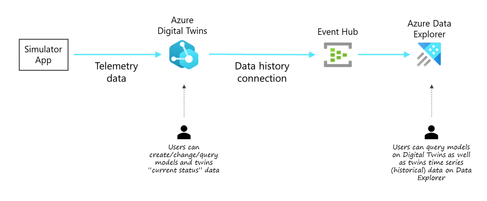
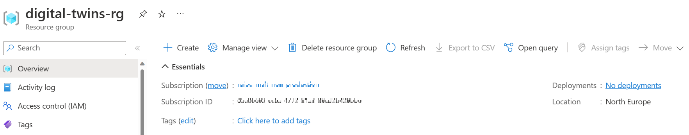
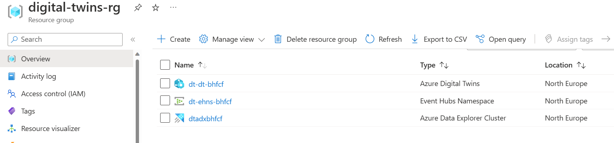

# Digital Twins lab

This lab allows to create a simple DT environment that includes the following components:
- Deployment scripts to create an Azure environment from scratch, namely an Azure Digital Twins instance and an Azure Data Explorer for historical data.
- Loads a sample "Home" model and twins to test.
- Uses a client program (developed in nodejs and using the Azure DT SDK) that sends sample telemetry to feed our twins.

The following picture describes the high level architecture of the DT environment used in this lab, including also Azure Data Explorer where all the DT time series historical data will be sink. Any change in the DT twins data will be automatically propagated to the Data Explorer time series database.




## Step 1. Collect your Azure information

First you need to collect the following settings from your Azure environment:
- Azure **Subscription Id**
- **Resource group** name where your environment will reside
- **Location** is the Azure Region where the resource group is lcoated and where the new resources to be created will reside.

To collect this information you can open Azure Portal and navigate to your Resource group to copy and paste the values.



In the above example the resource group name is "digital-twins-rg", location is "northeurope" (remove the spaces and put it lowercase) and you also have your subscription ID.

## Step 2. Customize the environment configuration

With the information collected in the previous step let's customize your configuration.

Open a Cloud Shell environment from your Azure Portal (by clicking the Shell symbol on the top) or by opening `https://shell.azure.com` and login with your user.


Inside the `deployment` folder, copy the `sample.env` file to a new file named `.env`


- Edit the new file `.env` and customize the following values:
    - 

## Prepare environment

Follow these steps.

1. Login using az cli or use your Cloud Shell

If using az cli in your workstation run this command. Skip this step if using Cloud Shell.
```
az login --tenant $tenant_id
```

2. Deploy environment

The scripts provided will create a new Azure Digital Twin instance on your Azure subscription.

Inside the `deployment` folder, copy the `sample.env` file to a new file named `.env`. Edit the new file `.env` and customize the following values:

```
cd deployment
cp sample.env .env
```


Run this script to create a new Azure Digital Twin instance
```
cd deployment
chmod +x deploy-01.sh
./deploy-01.sh
```


The creation of the resopurces might take a some minutes. In the end if you navigate in Azure Protal to your resource group your should have 3 resources created like this.




2. Setup ADT Models

```
chmod +x load-model-twins-02.sh 
./load-model-twins-02.sh
```


https://learn.microsoft.com/en-us/azure/digital-twins/concepts-query-language


3. Send sample data


4. Use Data History

https://learn.microsoft.com/en-us/azure/digital-twins/concepts-data-history


```
data-history-03.sh
```

Open data explorer, select database and:

.alter table adt_dh_rfp_digitaltwin_northeurope policy ingestionbatching @'{"MaximumBatchingTimeSpan":"00:00:10", "MaximumNumberOfItems": 500, "MaximumRawDataSizeMB": 1024}'


After this you can query the history table created.

adt_dh_dt_dt_bhfcf_northeurope


You can also do queries that include data in Digital twins


let ADTendpoint = "https://dt-dt-bhfcf.api.neu.digitaltwins.azure.net";
let ADTquery = ```SELECT SENSOR.$dtId as tid
FROM DIGITALTWINS ROOM 
JOIN SENSOR RELATED ROOM.rel_has_sensors 
WHERE ROOM.$dtId = 'LivingRoom-00-01'
AND IS_OF_MODEL(SENSOR , 'dtmi:com:adt:dtsample:sensor;1')```;
evaluate azure_digital_twins_query_request(ADTendpoint, ADTquery)
| extend Id = tostring(tid)
| join kind=inner (adt_dh_dt_dt_bhfcf_northeurope) on Id
| extend val_double = todouble(Value)
| where Key == "humidity"
| render timechart with (ycolumns = val_double)


Query

 SELECT * FROM digitaltwins
 WHERE IS_OF_MODEL('dtmi:com:adt:dtsample:sensor;1')


Data hoistory

https://learn.microsoft.com/en-us/azure/digital-twins/concepts-data-history

https://learn.microsoft.com/en-us/azure/digital-twins/how-to-use-data-history?tabs=cli


https://github.com/Azure-Samples/azure-digital-twins-getting-started