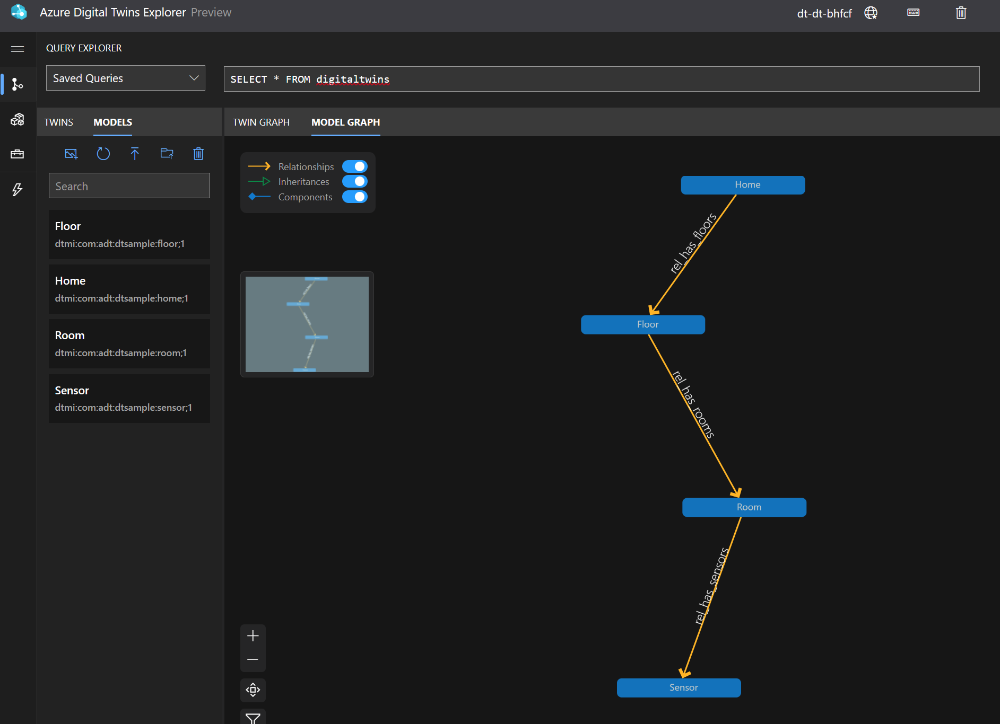

# Digital Twins lab

This lab allows to create a simple DT environment that includes the following components:
- Deployment scripts to create an Azure environment from scratch, namely an Azure Digital Twins instance and an Azure Data Explorer for historical data.
- Loads a sample "Home" model and twins to test.
- Uses a client program (developed in nodejs and using the Azure DT SDK) that sends sample telemetry to feed our twins.

The following picture describes the high level architecture of the DT environment used in this lab, including also Azure Data Explorer where all the DT time series historical data will be sink. Any change in the DT twins data will be automatically propagated to the Data Explorer time series database.


## Step 1. Collect your Azure information

First you need to collect the following settings from your Azure environment:
- Azure **Subscription Id**
- **Resource group** name where your environment will reside
- **Location** is the Azure Region where the resource group is lcoated and where the new resources to be created will reside.

To collect this information you can open Azure Portal and navigate to your Resource group to copy and paste the values.


In the above example the resource group name is "digital-twins-rg", location is "northeurope" (remove the spaces and put it lowercase) and you also have your subscription ID.


## Step 2. Customize the environment configuration

With the information collected in the previous step let's customize your configuration.

Open a Cloud Shell environment from your Azure Portal (by clicking the Shell symbol on the top) or by opening `https://shell.azure.com` and login with your user.


In the Cloud Shell promp just execute the following command to donwload the sample assets from the [GitHub repository](https://github.com/ruifelixpereira):

```
git clone https://github.com/ruifelixpereira/digital-twins.git
```

After this you should have the following directory structure.


Go to the `deployment` directory and copy the `sample.env` file to a new file named `.env`

```
cd deployment
cp sample.env .env
```

Edit the `.env` file and use the information collected in the previous step to populate your values.


## Step 3. Create your Digital Twins environment

With the configuration customized, you can now proceed to deploy the required Azure services.

Run this script to create a new Azure Digital Twin instance
```
cd deployment
chmod +x deploy-01.sh
./deploy-01.sh
```

In the Cloud Shell console you might get some asks. Just answer `Y` (Yes) to confirm.


The creation of the resources might take some minutes.


In the end, if you navigate in Azure Portal to your resource group your should have 3 resources created like this.


## Step 4. Explore your Digital Twin

The previous deployment, besides creating all the needed resources, it also loaded a sample model from the json files in the `models` directory and created some sample twins (one per each type).

In the Azure Portal you can navigate to your Digital Twin resource.


And click the option `Open Azure Digital Twin Explorer`. This opens a new web UI where you can explorer the model and the twins.

In the `Model Graph` you can see the model created with 4 types.



And you can check the details of any type by selecting it.


You can also go to the `Twin Graph` that should be blank. You need to click `Run Query` on the top to view the existing twins. In this example there is one twin of each type.


If you click in the `Sensor` twin or any other twin you can see all the details and property values.


You can explore additional queries, following the guidelines in the [documentation](https://learn.microsoft.com/en-us/azure/digital-twins/concepts-query-language).

This is a sample query to get all the twins from a specific type:

```
SELECT * FROM digitaltwins
WHERE IS_OF_MODEL('dtmi:com:adt:dtsample:sensor;1')
```

## Step 5. Send sample telemetry

If you navigate to the `send-telemetry` directory, you can run the sample client with:

```
npm install
npm start
```

That starts to send random telemetry to the `Sensor` twin, namely changing the `humidity` value.


You can check the values of `humidity` being changed in the Azure Digital Twins Explorer by selecting the Sensor twin in the graph.


## Step 6. Collect and explore Data History

Digital Twins can sink all the time series data into an external data storage. By default, Azure Data Explorer is the time series database used for collecting all the history. You can check more details in the [documentation](https://learn.microsoft.com/en-us/azure/digital-twins/concepts-data-history).

In the Azure Portal, navigate to the Azure Data Explorer resource.


And select the `Query` option.


Here you can see that a database was created with a table inside. This table receives all the historic data from the Digital Twin. Just copy the name of the table.

To start receiving data just execute the following command and be careful to replace the `<your_table_name>` with your specific name (`adt_dh_dt_dt_bhfcf_northeurope` in our example).

```
.alter table <your_table_name> policy ingestionbatching @'{"MaximumBatchingTimeSpan":"00:00:10", "MaximumNumberOfItems": 500, "MaximumRawDataSizeMB": 1024}'
```

Just execute this command and from now on you can see the data that is being injected by the simulator. You can query the data just by putting the name of the table in the query box and run it.


You can also do more complex queries that can be crossed with the model information coming from the Digital Twin. This is an example of such a crossing query with both data and model information and also playing with the type of output (a chart in this case instead of a table).


```
let ADTendpoint = "https://<your_digital_twin_hostname>";
let ADTquery = ```SELECT SENSOR.$dtId as tid
FROM DIGITALTWINS ROOM 
JOIN SENSOR RELATED ROOM.rel_has_sensors 
WHERE ROOM.$dtId = 'LivingRoom-00-01'
AND IS_OF_MODEL(SENSOR , 'dtmi:com:adt:dtsample:sensor;1')```;
evaluate azure_digital_twins_query_request(ADTendpoint, ADTquery)
| extend Id = tostring(tid)
| join kind=inner (<your_data_table>) on Id
| extend val_double = todouble(Value)
| where Key == "humidity"
| render timechart with (ycolumns = val_double)

```

In the above query, replace `<your_digital_twin_hostname>` with your Azure Digital Twin hostname and `<your_data_table>` with the name of your Data Explorer table. Paste and run the query and you should have a result like this.


Well done.